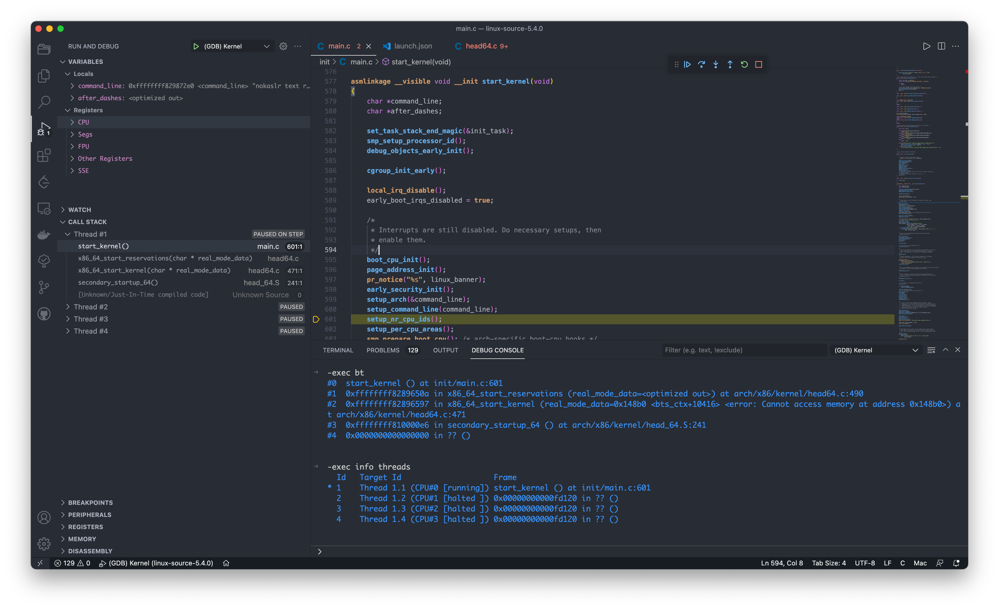

# 在macOS下搭建Linux内核调试环境

最近在看完[MIT 6.S081](https://pdos.csail.mit.edu/6.S081/2020/)课程后，对OS的整体运行过程有个初步的了解。之前看过《深入理解Linux内核》对linux内核有大致的概念，但具体内部的运行机制还是不深入。彻底了解OS内核就需要动手调试，眼看千遍不如手过一遍。

在学习6.S081过程中在macOS下使用QEMU运行xv6内核，使用GDB连接调试。在调试linux内核过程中采用同样的方式，基本过程是在QEMU上运行linux，使用GDB连接上进行调试。

本文记录了在macOS下搭建Linux内核调试环境，并使用VSCode进行调试的过程。主要内容有：

1. 使用QEMU安装虚拟机；
2. Linux内核编译；
3. 通过GDB/LLDB调试内核；
4. VSCode可视化调试。

## 1 使用QEMU安装虚拟机

### 1.1 安装QEMU

* 安装[Homebrew](https://brew.sh/)
  
  ```bash
  /bin/bash -c "$(curl -fsSL https://raw.githubusercontent.com/Homebrew/install/HEAD/install.sh)"
  ```

* 安装QEMU
  
  ```bash
  brew install qemu
  ```

### 1.2 安装虚拟机

* 下载Linux系统镜像
  以Ubuntu 20.04为例，下载[ubuntu-20.04.3-desktop-amd64.iso](https://ubuntu.com/download/desktop/thank-you?version=20.04.3&architecture=amd64)。
  
* 制作qemu启动的虚拟硬盘
  
  ```bash
  `qemu-img create -f qcow2 ubuntu.qcow2 40G`
  ```

  创建了一个40G的虚拟硬盘，qcow2是qemu支持的虚拟硬盘格式。其他详细用法可用`qemu-img -h`查看。

* 安装Ubuntu虚拟机
  
  ```bash
  qemu-system-x86_64 \ 
      -drive file=ubuntu.qcow2,if=virtio \
      -m 8G \
      -smp 4 \
      -cpu host \
      -display default,show-cursor=on \
      -usb \
      -device usb-tablet \
      -machine type=q35,accel=hvf \
      -boot menu=on \
      -net nic,model=virtio \
      -net user,hostfwd=tcp::2222-:22 \
      -cdrom ubuntu-20.04.3-desktop-amd64.iso
  ```

  安装好Ubuntu系统后，就可以去掉`-cdrom`直接启动系统。其他选项`-net nic,model=virtio`可设置虚拟网卡，`-net user,hostfwd=tcp::2222-:22`指定端口的映射，将本地的2222端口映射为虚拟机的22端口，可通过SSH访问虚拟机。
  
  关于`qemu-system-x86_64`其他选项可通过`qemu-system-x86_64 -h`查看，或查看<https://www.mankier.com/1/qemu>。
  
* 通过SSH连接虚拟机
  * 虚拟机上安装SSH
  
    ```bash
    sudo apt update 
    sudo apt install openssh-server
    ```

  * 在macOS上通过SSH连接虚拟机
  
    ```bash
    ssh -p 2222 <username>@localhost`
    ```

  * 通过scp上传或下载文件
  
    ```bash
    scp -P 2222 source target
    ```

## 2 编译Linux内核

### 2.1 编译内核

内核编译的教程和资料比较多，也可以参考这篇[Installing the kernel source](https://github.com/torvalds/linux/tree/v5.4/Documentation/admin-guide#installing-the-kernel-source)

主要的步骤如下:

```bash
#下载linux源码，也可以从kernel官网(https://www.kernel.org/)下载需要编译的版本
sudo apt install linux-source-5.4.0
#安装编译内核的所需的依赖包
sudo apt install -y flex bison make gcc libssl-dev bc libelf-dev libncurses-dev
#解压内核源码
tar -xvf linux-source-5.4.0.tar.bz2
cd linux-source-5.4.0
#配置内核编译选项
cp /boot/config-`uname -r` .config
#自定义内核配置，有多种方式
make menuconfig
#编译，-j后面的值是并行任务的数量
make -j16
#安装内核模块
sudo make modules_install
#安装内核
sudo make install
```

由于我们需要debug内核，需要在编译选项中开启调试信息，如下:

```bash
cp /boot/config-`uname -r` .config
make menuconfig
./scripts/config -e DEBUG_INFO -e DEBUG_KERNEL -e DEBUG_INFO_DWARF4
```

其他的调试选项，可以通过`cat .config | grep DEBUG`查看。

在编译过程中遇到编译失败的情况，继续运行`make -j16`后有提示信息，根据提示信息搜索解决即可。

使用Ubuntu官方源码，遇到的错误及解决方法如下：

```text
#编译错误
make[1]: *** No rule to make target 'debian/canonical-certs.pem', needed by 'certs/x509_certificate_list'.  Stop.

#解决方法
#编辑.config，修改CONFIG_SYSTEM_TRUSTED_KEYS为空
vim .config
CONFIG_SYSTEM_TRUSTED_KEYS=""
```

### 2.2 GRUB启动编译后内核

由于安装的Ubuntu不显示GRUB启动选项，需要修改GRUB配置。可通过`info -f grub -n 'Simple configuration'`查看所有的配置项。GRUB配置修改如下：

```bash
#编辑grub配置文件
sudo vim /etc/default/grub

#加载、保存上次选中的启动项
GRUB_DEFAULT=saved
GRUB_SAVEDEFAULT=true
#修改显示方式及超时时长
GRUB_TIMEOUT_STYLE=menu
GRUB_TIMEOUT=10

#保存配置文件后更新grub
sudo update-grub
```

重启系统后，显示GRUB启动选项，可以看到刚编译好的系统`Ubuntu, with Linux 5.4.148`，选中启动即可。

进入系统后，通过`uname -a`查看系统版本，显示内容有`5.4.148 GNU/Linux`说明编译好的系统已经能正常启动。

## 3 通过GDB/LLDB调试内核

### 3.1 启动调试内核

Linux的启动过程比较复杂，可以参考[The Linux/x86 Boot Protocol](https://github.com/torvalds/linux/blob/v5.4/Documentation/x86/boot.rst)。启动过程中需要指定kernel、initrd文件和可选的命令行参数。

QEMU支持指定Linux内核启动，在接下来的调试过程中采用QEMU指定内核的方式。需要将编译好的内核文件(`/boot/vmlinuz-5.4.148`和`/boot/initrd.img-5.4.148`)拷贝到macOS下。同时在调试过程中需要源码、编译后的执行文件、调试信息等，为了减少后续调试过程中缺少文件信息，需要将在Ubuntu中编译源码的整个文件夹拷贝到macOS下。

Linux为了提升系统安全性，默认开启了[KASLR](https://en.wikipedia.org/wiki/Address_space_layout_randomization)，系统启动的地址是随机的，不能正常调试，调试时需要关闭KASLR。

QEMU可通过`-gdb tcp::port`设置gdb远程调试端口，或`-s`(`-s shorthand for -gdb tcp::1234`)设置。修改后的QEMU启动配置如下：

```bash
qemu-system-x86_64 \
  -drive "file=ubuntu.qcow2,if=virtio" \
  -m 8G \
  -smp 4 \
  -kernel "vmlinuz-5.4.148" \
  -initrd "initrd.img-5.4.148" \
  -append "nokaslr text root=/dev/vda5 rw console=ttyS0" \
  -nographic -serial mon:stdio \
  -net nic,model=virtio \
  -net user,hostfwd=tcp::12222-:22 \
  -s -S \
```

### 3.2 LLDB调试内核

LLDB是macOS下默认的调试器，XCode安装后即可拥有。LLDB功能上与GDB类似，使用上和GDB有所差异，具体参见<https://lldb.llvm.org/use/map.html>。

LLDB调试内核的基本过程如下：

```bash
#加载linux执行文件
(lldb) file vmlinux

#源码路径映射
(lldb) settings set target.source-map [src on linux] [src on mac]

#连接gdb
(lldb) gdb-remote 1234
Process 1 stopped
* thread #1, stop reason = signal SIGTRAP
    frame #0: 0x000000000000fff0 vmlinux `entry_stack_storage + 4080
vmlinux`entry_stack_storage:
->  0xfff0 <+4080>: addb   %al, (%rax)
    0xfff2 <+4082>: addb   %al, (%rax)
    0xfff4 <+4084>: addb   %al, (%rax)
    0xfff6 <+4086>: addb   %al, (%rax)
Target 0: (vmlinux) stopped.

#设置断点
(lldb) b start_kernel 
Breakpoint 1: where = vmlinux`start_kernel + 39 at main.c:582:2, address = 0xffffffff82896d97

(lldb) c
Process 1 resuming
Process 1 stopped
* thread #1, stop reason = breakpoint 1.1
frame #0: 0xffffffff82896d97 vmlinux`start_kernel at main.c:582:2
  579   char *command_line;
  580   char *after_dashes;
  581  
-> 582   set_task_stack_end_magic(&init_task);
  583   smp_setup_processor_id();
  584   debug_objects_early_init();
  585  
Target 0: (vmlinux) stopped.
```

### 3.3 GDB调试内核

在macOS下使用GDB调试比较曲折，通过`brew instll gdb`安装后，使用过程遇到了以下问题：

1. GDB证书认证问题，解决方法参考[code-signing](https://opensource.apple.com/source/lldb/lldb-69/docs/code-signing.txt);
2. ``Symbol format `elf64-x86-64' unknown``执行程序格式不识别的问题，通过`brew install x86_64-elf-gdb`，使用`x86_64-elf-gdb`替代`gdb`。

解决上述问题后，GDB调试内核的基本过程如下：

```bash
#加载linux执行文件
(gdb) file vmlinux

#设置源码路径
(gdb) directory [src path]

#连接gdb
(gdb) target remote :1234
Remote debugging using :1234
0x000000000000fff0 in entry_stack_storage ()

#设置断点
(gdb) b start_kernel 
Breakpoint 1 at 0xffffffff82896d70: file init/main.c, line 578.

(gdb) c
Continuing.

Thread 1 hit Breakpoint 1, start_kernel () at init/main.c:578
578 {
```

## 4. VSCode可视化调试

使用VSCode调试的过程比较简单，需要安装对应的插件，并修改调试的配置文件即可。具体如下：

安装C/C++、Native Debug、CodeLLDB等插件。

创建`.vscode/launch.json`，使用GDB调试配置如下：

```json
"version": "0.2.0",
"configurations": [
    {
      "name": "(GDB) Kernel",
      "type": "cppdbg",
      "request": "launch",
      "program": "${workspaceFolder}/vmlinux",
      "miDebuggerServerAddress": "localhost:1234",
      "stopAtEntry": true,
      "stopAtConnect": true,
      "cwd": "${workspaceFolder}",
      "logging": {
          "engineLogging": false
      },
      "linux": {
          "MIMode": "gdb"
      },
      "osx": {
          "MIMode": "gdb"
      }
    }
]
```

VSCode调试配置可参考[Debugging](https://code.visualstudio.com/docs/editor/debugging#_launch-configurations)。

最终效果图如下：


### 参考

1. <https://pdos.csail.mit.edu/6.S081/2020/tools.html>
2. <https://www.mankier.com/1/qemu>
3. <https://github.com/torvalds/linux/tree/v5.4/Documentation/admin-guide#installing-the-kernel-source>
4. <https://github.com/torvalds/linux/blob/v5.4/Documentation/x86/boot.rst>
5. <https://en.wikipedia.org/wiki/Address_space_layout_randomization>
6. <https://lldb.llvm.org/use/map.html>
7. <https://code.visualstudio.com/docs/editor/debugging#_launch-configurations>
